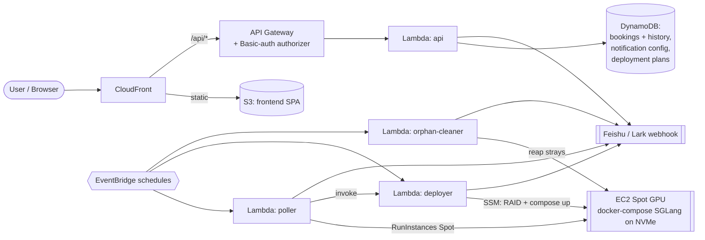

# sample-spot-gpu-inference-lab

> **Low-cost, one-click, self-service GPU inference test environments on AWS Spot GPU instances.**

Spin up a short-lived SGLang inference stack on a Spot GPU instance (H200 / B200 / B300)
from a web browser, run your ad-hoc test, get a Feishu (Lark) notification when it is
ready, and tear it down when you are done. No AWS console skills required, no long
capacity-reservation lead time, and every experiment is recorded for later audit.

> This repository is a companion to a blog post. It packages a working AWS CDK control
> plane, a React self-service portal, and four Python Lambdas so you can reproduce the
> pattern in your own account. It is provided as an AWS sample, not a supported product.

---

## Why this exists — the three pain points

Teams that need to benchmark or smoke-test large-model inference on GPUs kept hitting the
same three walls. This sample is built to knock each one down.

1. **GPU scarcity + testing is a short-lived, ad-hoc need.**
   A test may only need ~2 hours of GPU time, but a Capacity Block reservation typically
   means waiting **at least a day**. Waiting a day to run a two-hour test does not work.
   → This lab uses **Spot GPU capacity** plus a **CDK-deployed capacity poller** that
   scans regions/AZs every minute and grabs capacity the moment it appears (fast path,
   no reservation lead time).

2. **Business/line-of-business users are not fluent in AWS, and central-platform tickets are slow.**
   Routing every experiment through a central platform team adds days of latency for what
   should be a self-serve action.
   → This lab ships a **self-service React web portal**. A user picks an instance type and
   a deployment plan, clicks once, and the platform provisions, deploys, and reports back.

3. **Repeated experiments need traceability and audit.**
   When the same test is run many times, you need a durable record of what ran, when, and
   with what result.
   → This lab records every booking and state change in **DynamoDB**, exposes an in-app
   **History page**, and pushes state-change notifications to a **Feishu (Lark) bot** so
   there is both an in-product and a chat-side trail.

---

## 亮点 / Highlights（中英对照）

- **Spot GPU 快速路径 / Spot GPU fast path** —
  GPU 资源紧缺、测试往往只是临时需求（一次可能只要约 2 小时），而 Capacity Block 至少要等 1 天。
  本方案用 **Spot 实例 + CDK 部署的容量轮询器（capacity poller）** 每分钟扫描多区域/可用区，
  一旦出现容量立即抢占启动，避免预留等待。
  *GPU is scarce and tests are ad-hoc (~2h); Capacity Blocks take >= 1 day. Spot capacity plus a
  CDK-deployed poller grabs capacity as soon as it appears.*

- **自助 Web 门户 / Self-service web portal** —
  业务部门对 AWS 操作不熟悉，走中台支持流程太长。本方案提供 **React 自助门户**，
  选实例、选部署方案、一键下单，无需登录 AWS 控制台。
  *Business users are not AWS-fluent and central-platform tickets are slow; a React portal
  gives them a one-click self-service fast path.*

- **留痕与回溯 / Traceability and audit** —
  多次试验需要留痕和回溯。本方案将每次预约与状态变更写入 **DynamoDB**，
  提供站内 **History 页面**，并通过 **飞书（Lark）机器人** 推送状态变更通知。
  *Every experiment is recorded in DynamoDB, visible on an in-app History page, and pushed to a
  Feishu (Lark) bot for a durable audit trail.*

---

## Architecture

The platform is an AWS CDK stack deploying a static SPA (S3 + CloudFront), an API
(API Gateway + Lambda), DynamoDB state, and **four Python Lambdas** — `api`, `poller`,
`deployer`, and `orphan-cleaner` — coordinated by EventBridge schedules. Spot GPU
instances run docker-compose SGLang topologies on NVMe, and every state change fans out to
a Feishu webhook.

See the full diagram and component walkthrough in
**[docs/architecture/README.md](docs/architecture/README.md)** (committed Mermaid source).



---

## Repository structure

> **Layout note (read this so nothing surprises you):** the top-level `cdk/` directory is
> the CDK **control plane** — but because CDK asset paths (`lambda.Code.fromAsset`,
> `Source.asset`) are resolved relative to the CDK app, the **Lambda handlers and the React
> SPA live *inside* `cdk/`** as `cdk/lambda/` and `cdk/frontend/`. This mirrors the tested
> source layout exactly and keeps every asset path valid with zero code changes. It is
> intentional, not an accident.

```
sample-spot-gpu-inference-lab/
├── README.md                       # this file
├── LICENSE                         # MIT-0
├── CONTRIBUTING.md
├── CODE_OF_CONDUCT.md
├── .gitignore
├── docs/
│   ├── architecture/README.md      # Mermaid architecture diagram + walkthrough
│   ├── QUICKSTART.md               # deploy guide
│   └── TEARDOWN.md                 # cleanup / cost-governance guide
└── cdk/                            # CDK control plane (TypeScript)
    ├── bin/app.ts                  # app entry; account/region via context
    ├── lib/tpot-booking-stack.ts   # the stack (S3/CloudFront, API GW, DynamoDB, 4 Lambdas, EventBridge)
    ├── test/                       # Jest CDK assertion tests
    ├── cdk.json, package.json, tsconfig.json, jest.config.js
    ├── docs/UPDATE-COMPOSE.md      # how to update compose files in S3 without redeploy
    ├── frontend/                   # React + Vite + TypeScript SPA (self-service portal)
    │   └── src/pages/{Booking,History,Monitoring,Plans,Settings}Page.tsx
    └── lambda/                     # Python 3.x Lambda handlers
        ├── api/                    # REST API handler
        ├── poller/                 # capacity poller (Spot launch)
        ├── deployer/               # SSM docker-compose deployer
        │   └── compose-files/      # 7 SGLang docker-compose topologies (self-contained)
        └── orphan-cleaner/         # reaps stray Spot instances
```

---

## Prerequisites

- An **AWS account** you can deploy into (the CDK stack creates EC2/IAM/S3/CloudFront/DynamoDB/Lambda/API Gateway resources).
- **Node.js 22** and npm.
- **Python 3.9+** (the Lambdas target a Python 3.x runtime; local tooling only needs Python for optional yaml validation).
- **AWS CDK** and **ts-node** installed globally (synth uses `ts-node`):
  `npm i -g aws-cdk ts-node`
- Your **account id and region** supplied via CDK context (`-c account=... -c region=...`)
  or `CDK_DEFAULT_ACCOUNT` / `CDK_DEFAULT_REGION`.
- A **subnet map** for the poller (AZ → subnet id), supplied via the `SUBNET_MAP_CONFIG`
  environment variable on the poller Lambda.

---

## Quickstart

Full step-by-step deploy instructions (build the frontend first, `cdk deploy`, set
`SUBNET_MAP_CONFIG`, upload the SPA, configure the Feishu webhook) are in
**[docs/QUICKSTART.md](docs/QUICKSTART.md)**.

To change SGLang docker-compose topologies **without** a redeploy, see
**[cdk/docs/UPDATE-COMPOSE.md](cdk/docs/UPDATE-COMPOSE.md)**.

## Cost story & cleanup

Spot GPU capacity is the whole point: you pay only for the short-lived test window instead
of holding a Capacity Block reservation. The trade-off is that Spot instances can be
interrupted, which is acceptable for ad-hoc tests. **Always tear the environment down when
you are finished** — a forgotten GPU instance is expensive. The `orphan-cleaner` Lambda
reaps stray instances on a schedule as a safety net, but you should still run the teardown
and verify. See **[docs/TEARDOWN.md](docs/TEARDOWN.md)**.

---

## Configuration & security note

Nothing sensitive is baked into this sample. Everything environment-specific is
operator-provided and overridable:

- **Account id & region** — pass via CDK context (`-c account=<ID> -c region=<REGION>`) or
  the `CDK_DEFAULT_ACCOUNT` / `CDK_DEFAULT_REGION` environment variables. `bin/app.ts`
  carries a fallback value for reference only; override it for your account.
- **Subnets** — the poller reads an AZ→subnet map from the `SUBNET_MAP_CONFIG` environment
  variable (comma-separated `az=subnet-id` pairs). The values in `lambda/poller/handler.py`
  are defaults you are expected to override for your VPC.
- **Resource names** (instance profile, security group, IAM role, script bucket) are set in
  the CDK stack and can be renamed to fit your naming conventions.
- **Feishu (Lark) webhook** — **not** stored in code. It is configured at runtime through
  the portal's **Settings** page and persisted in the DynamoDB notification-config table
  (`configId=global`). There is no credential in this repository.
- **Portal auth** — the SPA uses HTTP Basic auth validated by a Lambda authorizer against
  an SSM SecureString parameter (`/tpot-booking/basic-auth-credentials`); you provision the
  credential value yourself. No credentials ship in this repo.

---

## License

This sample is licensed under **MIT-0**. See [LICENSE](LICENSE).
