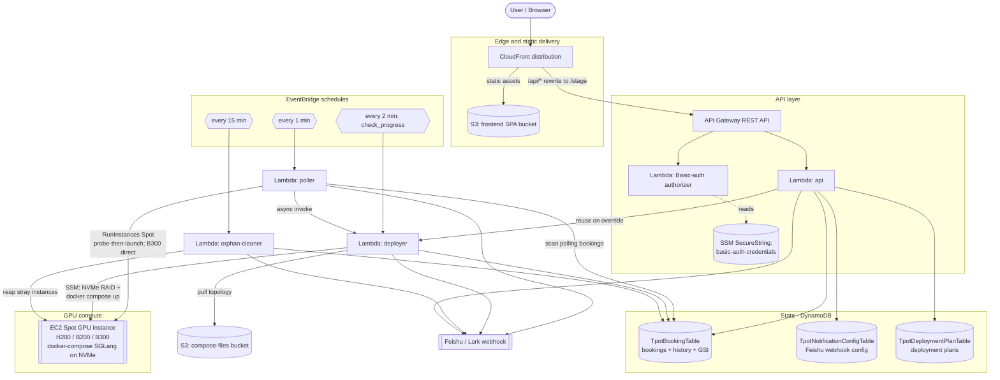

# Architecture

This document describes the runtime architecture of the sample. The diagram below is
committed as Mermaid source so it stays in version control and renders directly on GitHub.
It reflects the actual CDK stack (`cdk/lib/tpot-booking-stack.ts`) and the four Python
Lambda handlers under `cdk/lambda/`.

> Mermaid is the committed default. If you want a raster export for a slide deck or blog
> post, paste the block below into the [Mermaid Live Editor](https://mermaid.live) and
> export a PNG/SVG.

## Components at a glance

- **Static SPA** — React/Vite build served from an **S3** bucket behind **CloudFront**.
- **API** — **CloudFront** forwards `/api/*` to **API Gateway** (a CloudFront Function
  rewrites `/api/...` → `/<stage>/...`). API Gateway uses a **Lambda authorizer** doing
  HTTP Basic auth against an **SSM** SecureString parameter, then invokes the **`api`
  Lambda**.
- **State — DynamoDB (3 tables)**:
  - `TpotBookingTable` — bookings + their status history (with an
    `instanceType-status-index` GSI).
  - `TpotNotificationConfigTable` — the Feishu webhook config (`configId=global`).
  - `TpotDeploymentPlanTable` — deployment plans.
- **`poller` Lambda** — EventBridge triggers it every minute. It scans for bookings in
  `polling` state and directly launches a **Spot GPU** instance (`RunInstances` with Spot
  market options) in the first region/AZ that has capacity, using an AZ→subnet map from
  `SUBNET_MAP_CONFIG`. B300/B200/H200 use a **direct-launch** path (probe-then-launch is too
  slow for short B300 capacity windows). On success it flips the booking to `launching`
  (conditional write to avoid duplicate launches) and asynchronously invokes the deployer.
- **`deployer` Lambda** — two-phase. Phase 1 (`deploy`, invoked by the poller) waits for
  SSM reachability, then sends a long-running **SSM** command that sets up **NVMe RAID**,
  downloads the model, and runs **`docker compose` pull + up** for the selected SGLang
  topology. Phase 2 (`check_progress`, EventBridge every 2 min) polls the SSM command and
  the service health endpoint, then marks the booking `ready` or `failed`.
- **`orphan-cleaner` Lambda** — EventBridge every 15 min. Reaps stray tagged Spot instances
  that are no longer tracked by an active booking, as a cost safety net.
- **Notifications** — every state-change Lambda pushes to the **Feishu (Lark) webhook**
  (with SNS as a fallback topic). The webhook URL is read at runtime from the DynamoDB
  notification-config table.
- **Compose files** — 7 SGLang `docker-compose-*.yaml` topologies are bundled with the
  deployer and deployed to an S3 compose bucket; they can be updated in S3 without a
  redeploy (see [`../../cdk/docs/UPDATE-COMPOSE.md`](../../cdk/docs/UPDATE-COMPOSE.md)).

## Diagram

## Key CloudFormation outputs

The stack emits (see `cdk/lib/tpot-booking-stack.ts`):

| Output | Meaning |
| --- | --- |
| `ApiUrl` | API Gateway base URL |
| `CloudFrontDomain` | CloudFront domain that serves the SPA and proxies `/api/*` |
| `FrontendBucketName` | S3 bucket to sync the built SPA into |
| `ComposeBucketName` | S3 bucket holding the docker-compose topologies |
| `BookingTableName` | bookings + history DynamoDB table |
| `NotificationConfigTableName` | Feishu webhook config table |
| `DeploymentPlanTableName` | deployment plans table |
| `NotificationTopicArn` | SNS fallback topic |
